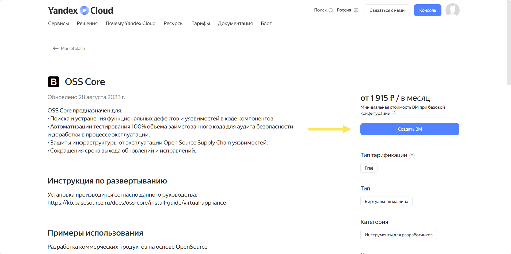

# Yandex Cloud

Для того, чтобы установить приложение, нужно перейти на страницу продукта и выбрать "Создать ВМ"

<figure><figcaption></figcaption></figure>

После этого при условии успешной аутентификации пользователь попадает на страницу создания виртуальной машины (далее ВМ). На этой странице нужно задать желаемую конфигурацию и указать `ssh-ключ`, который будет использоваться для доступа к ВМ.

1. В полях **Имя** и **Описание** задайте имя ВМ и опишите её предназначение

<figure><figcaption></figcaption></figure>

2. Загрузочный образ уже выбран - это образ с приложением **OSS Core**

<figure><figcaption></figcaption></figure>

3. В разделе **Диски и файловые хранилища** укажите желаемый размер диска создаваемой ВМ

<figure><figcaption></figcaption></figure>

4. В разделе **Вычислительные ресурсы** укажите количество ядер процессора и желаемый объём оперативной памяти

<figure><figcaption></figcaption></figure>

5. В разделе **Сетевые настройки** укажите желаемую конфигурацию или оставьте настройки по умолчанию

<figure><figcaption></figcaption></figure>

6. В разделе **Доступ** нужно указать логин, с которым будет осуществляться доступ к терминалу ВМ и публичный ssh-ключ для такого доступа

<figure><figcaption></figcaption></figure>

Как создать ssh-ключ можно посмотреть в этой инструкции [Как подключиться к виртуальной машине Linux по SSH | Yandex Cloud - Документация](https://cloud.yandex.ru/docs/compute/operations/vm-connect/ssh). После создания, вставьте текстовую строку с ключом в поле "SSH-ключ"

7. После этого нажмите кнопку "Создать ВМ" - вы перейдёте на страницу со списком виртуальных машин, и через какое-то время ваша виртуальная машина будет готова к использованию
8. После создания ВМ для входа перейдите в браузере на страницу `https://<публичный_IP-адрес_ВМ>`".
9. Дальнейшая работа с системой описана в разделе [https://kb.basesource.ru/docs/oss-core-otester/user-guide](https://kb.basesource.ru/docs/oss-core-otester/user-guide)&#x20;
