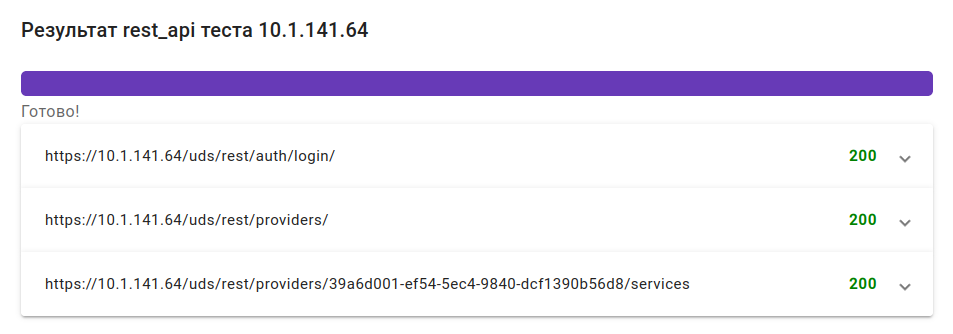

# Руководство пользователя

### Вход в систему 

Для доступа вам понадобятся IP-адрес или имя машины, на которой запущен контейнер с приложением, а также порт подключения (по умолчанию - `4200`).

Откройте приложение в браузере, указав адрес в формате: `http://<IP-адрес или имя машины>:4200`.

Авторизуйтесь в появившемся окне входа в систему, чтобы продолжить работу:

<figure><figcaption></figcaption></figure>

При первом входе используйте следующие учетные данные:

* Имя пользователя: `admin`
* Пароль: `osscore123@`

После входа в систему вы можете сменить пароль, выбрав соответствующий пункт в выпадающем меню пользователя:

<figure><figcaption></figcaption></figure>

### Интерфейс приложения 

В верхней части интерфейса доступны кнопки для выполнения следующих операций:

| .png>) | Добавить файл              |
| :-------------------------------------------: | -------------------------- |
|     | Удалить отмеченные тесты   |
|       | Запустить отмеченные тесты |

В основной части отображается перечень загруженных тестов, включая следующую информацию:

* `IP сервера`: IP адрес тестируемого сервера;
* `Модуль`: тип выполняемого теста;
* `Имя файла`: имя загруженного yml файла;
* `Псевдоним`: алиас теста;
* `Дата создания`: дата добавления теста.

<figure><figcaption></figcaption></figure>

Для сортировки данных по возрастанию/убыванию используйте кнопку рядом с именем столбца: 

Чтобы задать фильтр по данным, в выпадающем списке под именем столбца выберите логику фильтра и значение, затем нажмите `Filter`. Для сброса фильтра нажмите `Reset`.

<figure><figcaption></figcaption></figure>

В нижней части интерфейса доступны элементы управления отображением информации:

* переключение между страницами при большом количестве загруженных тестов;
* настройка количества элементов на странице.

<figure><figcaption></figcaption></figure>

### Работа с тестами 

#### Добавление 

Для добавления теста нажмите кнопку .png>), выберите в открывшемся диалоге файл для загрузки.

Для загрузки и просмотра содержимого файла добавленного теста, найдите строку с ним в перечне тестов и нажмите .

#### Удаление 

Для удаления поставьте отметку  в строках с нужными тестами, затем нажмите .

#### Запуск 

Для запуска теста найдите строку с нужным тестом в перечне и нажмите .

Для запуска нескольких тестов поставьте отметку  в строках с нужными тестами, затем нажмите .

#### Результаты 

После запуска теста откроется окно, отображающее ход тестирования и его результаты: перечень выполненных проверок, с адресом запроса и ответом от тестируемого сервиса (статусом выполнения).

<figure><figcaption></figcaption></figure>

<figure><figcaption></figcaption></figure>

Чтобы посмотреть подробное содержимое ответа, разверните нужную строку запроса, нажав на нее.

<figure><figcaption></figcaption></figure>

<figure><figcaption></figcaption></figure>

**Примечание:** процесс создания yml файлов с тестами описан в [руководстве администратора](admin-guide.md).

